<h1 align="center">

</h1>

&nbsp;
&nbsp;
&nbsp;

 

 

  
  
   
  
  
  

  
  
  
  
  
  

 

  
  
   
   
   
   
  
  

    
  - 🔭 Open to work as **Data Enginner / ML Enginner**

  - 🎓 CS grad | First-year MSc, Data Engineering (LPNU)
  
  - 🌱 I’m currently learning **ETL, Big Data, SQL & Query Optimization**
  
  - 💼 Check out my [portfolio](https://fesenko-portfolio.vercel.app/)
  
  - 📫 How to reach me **mfesenko2003@gmail.com**
  
  - 📝 Authoring a paper on YOLO & Mask R-CNN for satellite imagery
  
  

 
 

 

<picture>

<source media="(prefers-color-scheme: dark)" srcset="https://raw.githubusercontent.com/Karoshi-man/Karoshi-man/output/github-snake-dark.svg" />

<source media="(prefers-color-scheme: light)" srcset="https://raw.githubusercontent.com/Karoshi-man/Karoshi-man/output/github-snake.svg" />

</picture>

<picture>
  <source media="(prefers-color-scheme: dark)" srcset="https://raw.githubusercontent.com/Karoshi-man/Karoshi-man/pacman-output/pacman-contribution-graph-dark.svg">
  <source media="(prefers-color-scheme: light)" srcset="https://raw.githubusercontent.com/Karoshi-man/Karoshi-man/pacman-output/pacman-contribution-graph.svg">
  
</picture>

